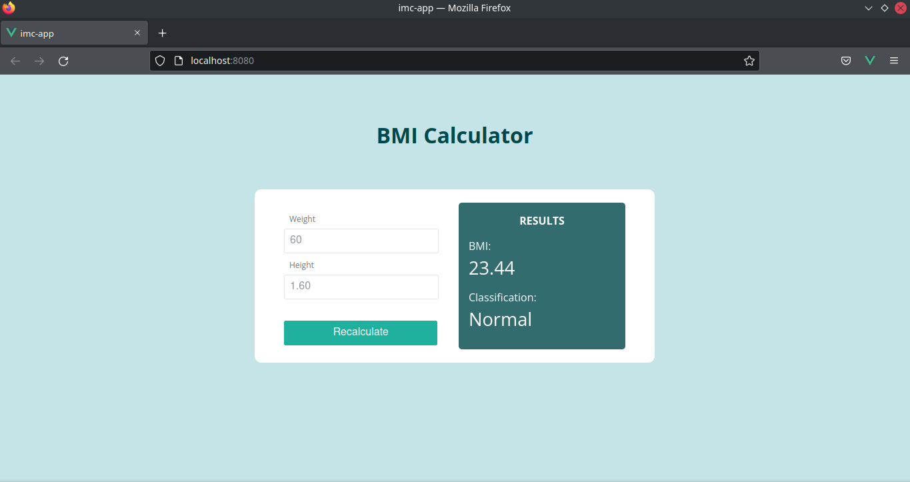
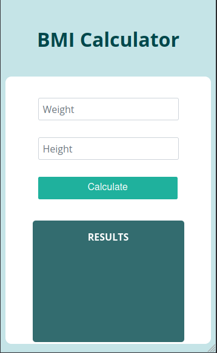
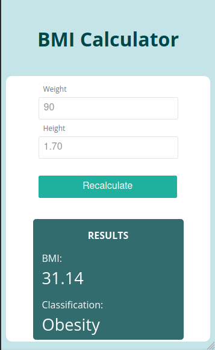

<h1 align="center">IMC CALCULADORA / BMI CALCULATOR</h1>
 
 

Durante o Bootcamp Desenvolverdor(a) Front End, tive um módulo de Vue.js e um dos Desafios Guiados do módulo era desenvolver o projeto de uma calculadora de IMC. 
Nesse projeto foi utilizado alguns componentes do Prime Vue, como o Button, Input Text e Input Mask.

Entretanto, o professor fez um projeto bem simples, então tive a ideia de melhorar o visual dele, pensando em um layout mais atrativo. Com isso, dei uma pesquisada no Pinterest, algumas referências de layout que eu poderia aplicar em meu projeto, e apesar da estilização tema do Prime Vue, fiz algumas alterações por cima para que ficasse da forma que havia imaginado. 

 
<legend>Versão desktop - Estado inicial  </legend>

<legend>Versão desktop - Resultado calculado </legend>

 
<legend>Versão mobile - Estado inicial  </legend>

<legend>Versão mobile - Resultado calculado </legend>

